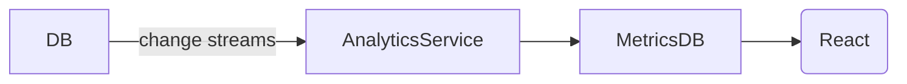

# Advanced MERN-Based Two-Way Support System

This blueprint details a full-featured, MERN (MongoDB, Express, React, Node) stack–powered two‑way support platform that includes real‑time communication, AI-driven assistance, agent workflows, analytics, and learning chatbots.

---

## 1. High-Level MERN Architecture

```mermaid
flowchart LR
  subgraph Frontend (React)
    U[User Portal]
    CB[Chatbot Widget]
    A[Admin Console]
  end

  subgraph Backend (Node + Express)
    API[Express API]
    WS[Socket.io Service]
    NLP[NLP & AI Engine]
    DB[(MongoDB via Mongoose)]
    KB[(Knowledge Base)]
    Mail[SendGrid / SMTP]
    Queue[Bull Job Queue]
    Analytics[Analytics Microservice]
  end

  U -->|axios: POST /api/tickets| API --> DB
  API -->|emit ticket.new| WS
  API --> Mail
  CB -->|nlpClient.query()| NLP --> KB
  NLP -->|suggestResponse()| CB
  CB -->|lowConfidence → POST /api/tickets| API
  A -->|axios: GET /api/tickets| API
  A -->|axios: POST /api/tickets/:id/reply| API --> DB
  API --> Queue.process() --> Mail
  WS <-->|socket events| A
  WS <-->|socket events| U
  DB --> Analytics.ingest()
  Analytics --> A
  Analytics --> Dashboard(UI)
```

**Tech choices:**

* **MongoDB** with Mongoose for data modeling (Ticket, ThreadEntry, SLA schemas).
* **Express** for REST endpoints under `/api/*`.
* **Socket.io** for bi‑directional, real‑time events on both user and admin.
* **React** (with Context or Redux) for frontend UI components.
* **Bull** (Redis‑backed) for background email jobs and SLA timers.

---

## 2. Permission-Based Routing (Express + Mongoose)

```mermaid
flowchart TD
  T[POST /api/tickets]
  T --> Cat[tagByKeywords(ticket.body)]
  Cat -->|Billing| Q1[Queue: billing]
  Cat -->|Technical| Q2[Queue: tech]
  Cat -->|Account| Q3[Queue: account]

  subgraph Assignment Service
    Q1 & Q2 & Q3 --> Avl[checkAgentAvailability()]
    Avl -->|agent| assignRoundRobin()
    Avl -->|none| escalateToManager()
  end

  assignRoundRobin() --> saveAssignment(mongoose)
  escalateToManager() --> notifyManager()

  saveAssignment & notifyManager --> emit WS.ticket.new
```

**Implementation notes:**

* Use a Mongoose pre-save hook or service layer to detect categories.
* Maintain an `agents` collection with `isAvailable` flag.
* Round-robin assignment via a rotating index stored in Redis or DB.

---

## 3. Real-Time Two-Way Communication (Socket.io)

1. **Server (Node):**

   ```js
   const io = require('socket.io')(server);
   io.on('connection', socket => {
     socket.join(`ticket_${ticketId}`);
     // emit: io.to(`ticket_${id}`).emit('ticket.update', data);
   });
   ```
2. **Client (React):**

   ```js
   import io from 'socket.io-client';
   const socket = io('/');
   useEffect(() => {
     socket.on('ticket.update', update => setThread(prev => [...prev, update]));
   }, []);
   ```
3. **Flows:**

   * `ticket.new` → both Admin and relevant User rooms.
   * `ticket.reply` & `status.change` → broadcast to ticket room.

---

## 4. Analytics & SLA Monitoring

**Ingestion Pipeline:**

1. After DB write (`ticket.reply` or `ticket.close`), call `AnalyticsService.trackEvent()`.
2. Analytics service (Node microservice) processes and stores metrics in a separate MongoDB or Timeseries DB.



**Key Metrics:**

* **First Response Time** (dateDiff(openAt, firstReplyAt))
* **Total Resolution Time** (dateDiff(openAt, closedAt))
* **SLA Breaches** (compare resolution vs SLA threshold)
* **Ticket Volume** (per day/week by category)
* **CSAT Scores** (embed survey on resolution)

---

## 5. Self-Learning Chatbot (AI + Feedback Loop)

```mermaid
flowchart TB
  UQ[User Question]
  UQ -->|REST /ai/query| NLPService
  NLPService --> KBService.search()
  KBService -->|suggest| NLPService
  NLPService -->|confidence>0.8| AutoReply[auto-respond]
  NLPService -->|else| createTicket()
  createTicket() -->|POST /api/tickets| API
  API --> DB

  subgraph Agent Review
    DB --> AdminConsole
    AdminReply -->|PATCH /api/tickets/id/reply| API
  end

  AdminReply & AutoReply -->|Feedback| NLPService.learn()
```

**Components:**

* **NLPService**: Node server using TensorFlow\.js or external API (OpenAI) for intent classification.
* **KBService**: full-text search on MongoDB or Elasticsearch index of help articles.
* **Learning Module**: logs feedback (thumbs-up/down) to refine the model periodically.

---

## 6. SLA Automation & Background Jobs (Bull)

* **Queue process** in Node:

  ```js
  const Queue = require('bull');
  const slaQueue = new Queue('sla-reminders');

  // schedule a reminder 30min before due
  slaQueue.add({ ticketId }, { delay: computedDelay });

  slaQueue.process(async job => {
    const { ticketId } = job.data;
    const ticket = await Ticket.findById(ticketId);
    if (ticket.status !== 'closed') notifySlackOrEmail(ticket);
  });
  ```
* **Auto-close** jobs scheduled 7 days after resolution.

---

## 7. Knowledge Base Integration (React + API)

* **Agent Compose Component** fetches `/api/kb?query=...` as user types.
* **One-click Insert** inserts markdown link into reply editor.
* **Feedback Button** flags article via `POST /api/kb/feedback`.

---

## 8. Security & Permissions (JWT + Middleware)

* Protect `/api/admin/*` and `/api/engineering/*` routes with role checks.
* Middleware example:

  ```js
  function requireRole(role) {
    return (req, res, next) => {
      if (req.user.role !== role) return res.status(403).send('Forbidden');
      next();
    };
  }
  app.use('/api/admin', requireJWT, requireRole('manager'));
  ```

---

## Next Steps

1. Define Mongoose schemas (Ticket, User, Agent, KBArticle).
2. Scaffold Express routes and React pages.
3. Configure Socket.io integration and React hooks.
4. Set up Bull jobs for SLA and email notifications.
5. Integrate AI/NLP and KB search services.
6. Build analytics dashboards with Chart.js or Recharts.
7. Pilot end‑to‑end and iterate based on feedback.
