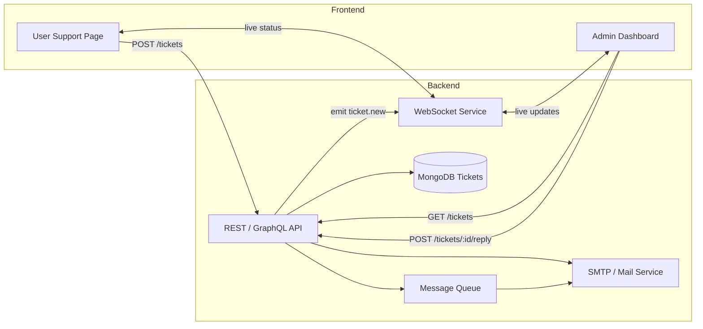
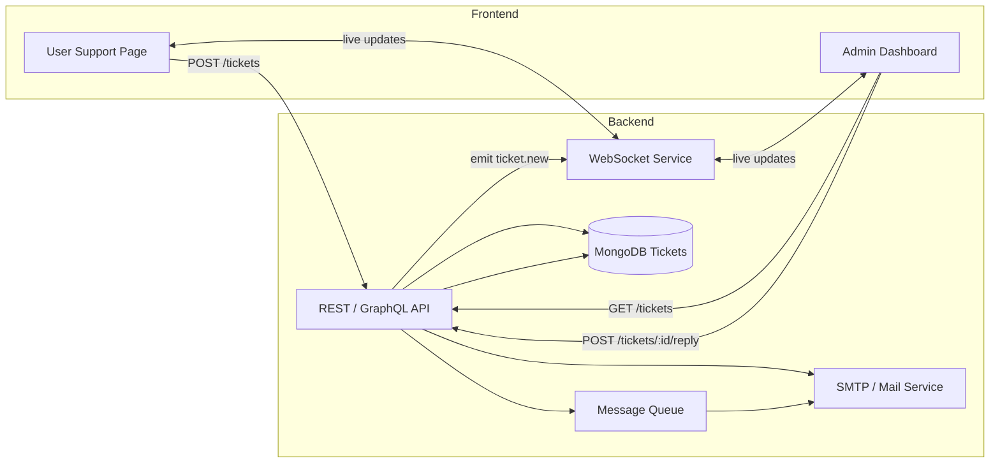

Here’s a high-level blueprint for a two-sided support system—one “Customer” side and one “Admin” side—showing the architecture, data-flow and key components you’ll need to build in React (frontend) + Node/Mongo (backend), but you can swap in whatever stacks you prefer.

---

## 1. System Architecture



* **Frontend**

  * **User Support Page**: “Submit Request” form (you already have), plus a “Track Ticket” view where user enters Ticket ID to see status & replies.
  * **Admin Dashboard**: central ticket list, filters (status, priority, category), detail panel (conversation thread + reply composer), agent-assignment controls.

* **Backend**

  * **API Layer** (Node/Express or GraphQL) to handle create/read/update of tickets, replies, status changes.
  * **WebSocket Service** (Socket.io or server-sent events) for real-time push of new tickets and replies.
  * **Database**: a `tickets` collection, each doc:

    ```js
    {
      _id,
      customer: { name, email, phone },
      category, priority, subject, createdAt, status, 
      thread: [ { from: "user"|"admin", message, timestamp } ],
      assignedTo?: agentId
    }
    ```
  * **Mail/Notifications**: SMTP or third-party (SendGrid) to notify user when admin replies.
  * **Message Queue** (optional) to buffer email jobs.

---

## 2. Customer-Facing Flow

1. **Submit Ticket**

   * Fill out form → `POST /tickets` → creates ticket, returns `ticketId`.
   * Show “Success” modal (you have this) with `ticketId`.

2. **Track & Reply**

   * “Track Ticket” page where user enters ID → `GET /tickets/:id` → displays ticket metadata + thread.
   * Optionally allow user to append additional messages: `POST /tickets/:id/reply`.

3. **Real-Time Updates**

   * Use WebSocket or polling so if admin responds, user sees reply immediately.

---

## 3. Admin-Facing Flow

1. **Dashboard List**

   * On load: `GET /tickets?status=open` → paginated table: columns \[ID, customer, subject, priority, status, createdAt].
   * Filters: status, priority, category, date-range.

2. **Detail & Reply Panel**

   * Click a row → slide-out panel or modal → fetch `GET /tickets/:id` → show:

     * Customer info
     * Thread (user & previous replies)
     * Controls: change status (open, pending, closed), reassign agent, priority/category edit.
     * Reply textarea → `POST /tickets/:id/reply`.

3. **Live Notifications**

   * Socket.io listener for `ticket.new` so agents see new incoming tickets in real time.
   * Desktop/browser notification badge.

4. **Agent Assignment & SLA**

   * Auto-assign to agent pools, or manual assign.
   * Show SLA countdown (e.g. “respond within 24 hrs”) with visual cue.

---

## 4. Component & Folder Structure (React)

```
src/
├─ api/                   ← axios or graphql clients
├─ components/
│  ├─ Customer/
│  │  ├─ SubmitForm.js
│  │  ├─ TicketTracker.js
│  ├─ Admin/
│  │  ├─ TicketTable.js
│  │  ├─ TicketDetailPanel.js
│  │  ├─ FiltersBar.js
│  ├─ UI/                 ← Buttons, Modals, Inputs, Icons
├─ contexts/              ← Auth, WebSocketContext
├─ hooks/                 ← useTickets, useWebSocket
├─ pages/
│  ├─ /support            ← customer
│  │  ├─ index.js
│  ├─ /admin              ← admin
│  │  ├─ index.js
└─ utils/                 ← date formatting, notification helpers
```

* **State Management**: React Context or Redux for global (tickets list, auth, socket).
* **Styling**: Tailwind CSS (as you’re using), keep design tokens in a single file for consistency.

---

## 5. API Endpoints (REST Example)

| Method | Path                 | Body / Query                        | Function                                  |
| ------ | -------------------- | ----------------------------------- | ----------------------------------------- |
| POST   | /tickets             | `{ customer, subject, message… }`   | Create ticket                             |
| GET    | /tickets             | `?status=open&priority=high&page=…` | List & filter tickets                     |
| GET    | /tickets/\:id        | —                                   | Get single ticket with full thread        |
| POST   | /tickets/\:id/reply  | `{ from: "admin", message }`        | Append reply & trigger notification/email |
| PATCH  | /tickets/\:id/status | `{ status: "closed" }`              | Change ticket status                      |
| PATCH  | /tickets/\:id/assign | `{ agentId: "…" }`                  | Assign to agent                           |

---

## 6. Data-Flow & Real-Time

1. **User submits** → API writes to DB → emits `ticket.new` over WebSocket + sends confirmation email.
2. **Admin dashboard** hears `ticket.new` → highlights new row.
3. **Admin replies** → API updates DB thread → enqueues email to user + emits `ticket.reply` to both admin & user socket rooms.
4. **User socket** receives `ticket.reply` → appends to thread view live.

---

## 7. Scaling & Extras

* **Pagination & Caching**: use cursor-based pagination for large ticket volume.
* **Search & Full-Text**: index subject/message in Mongo or add ElasticSearch for advanced queries.
* **RBAC**: protect admin routes with JWT + roles.
* **Attachments**: support file uploads by streaming to S3 and storing link in thread.
* **Analytics**: track metrics (avg response time, tickets per category) and expose in admin “Stats” panel.

---

With this foundation you can evolve a simple React form into a full-featured support center. Feel free to ask for deeper dives on any section (e.g. sample Express code, WebSocket setup, detailed React hook patterns, or DB migration scripts)!


---
#IDea 2
--
# Dvika Support Center Architecture & Layout

> *External brand: “Dvika Care”*
> Support email: **[dvika.care@gmail.com](mailto:dvika.care@gmail.com)**

---

## Two-Sided Support System

**External User (Dvika Care)**

* Submit support requests via web form, email, chat widget, or API
* Track ticket status and replies
* Browse FAQs and Knowledge Base

**Internal Admin & Agents**

* View and triage incoming tickets
* Reply, escalate, and manage SLAs
* Access analytics and reporting dashboards

---

## Ticket Lifecycle & Statuses

1. **New** – just created (via web, email, widget, or API)
2. **Open / Triaging** – agent picks up for initial assessment
3. **In Progress** – actively being worked
4. **On Hold / Waiting on Customer** – blocked until user supplies info
5. **Escalated** – handed off to L2 or engineering
6. **Resolved** – solution provided; awaiting confirmation
7. **Closed** – confirmed resolved or auto-closed after X days

> *Each status change triggers internal notifications and ticks against SLA timers.*

---

## Channels of Intake

* **Dvika Care Bot** (in-app & chat widget)
* **Email** ([support@dvika.care](mailto:support@dvika.care)@gmail.com)
* **Slack Slash-Command** (`/dvika-care new`)
* **API / Webhook** (partner integrations)

> *All incoming items auto-create tickets with captured fields (user, issue type, priority, attachments).*

---

## Triage & Routing Rules

* **Keyword-Based Tagging** (e.g. “billing” → Billing queue)
* **Priority Mapping** (P1 bugs escalate immediately)
* **Round-Robin or Load-Based Assignment** among available agents
* **Auto-Escalation** if not picked up within SLA window

---

## Internal Dashboard & Views

| View                  | Visible To           | Key Columns                        |
| --------------------- | -------------------- | ---------------------------------- |
| My Open Tickets       | Support Agents       | Ticket #, Subject, Priority, Age   |
| All Tickets           | Managers & Admin     | + Queue, Assigned To, SLA Status   |
| Escalation Queue      | Managers & Engineers | + Origin Agent, Escalation Reason  |
| SLA Breaches          | Managers             | Ticket #, Breach Type, Breach Time |
| Knowledge Suggestions | All                  | Auto-suggested KB article links    |

---

## Knowledge Base Integration

* Contextual article suggestions as tickets are typed
* One-click “Insert KB link” in agent replies
* Feedback loop: agents flag outdated articles or suggest new ones

---

## Automations & Macros

* Canned responses for FAQs (onboarding, pricing, API keys)
* Macros to update status + add internal note + notify user
* SLA reminders: Slack pings 30 min before breach
* Auto-close inactive tickets (> 7 days) with customer nudge

---

## Notifications & Escalations

* Slack alerts in `#dvika-care-alerts`
* Email digests for managers (daily summary of new, breached, escalated)
* Push notifications in internal app

---

## Reporting & Analytics

* First response time (avg. by agent / queue)
* Resolution time (avg. and distribution)
* Ticket volume trends (daily / weekly)
* CSAT surveys embedded in resolved tickets
* Heatmaps of peak request hours

> *Embed dashboards (e.g. Metabase, Data Studio) into the Admin view.*

---

## System Architecture



---

## Customer-Facing Flow

1. **Submit Ticket**

   * Fill out form → `POST /tickets` → server creates ticket, returns `ticketId`
   * Show “Success” modal with `ticketId`

2. **Track & Reply**

   * User enters ID on “Track Ticket” page → `GET /tickets/:id` → displays metadata + thread
   * Optionally allow user to append messages: `POST /tickets/:id/reply`

3. **Real-Time Updates**

   * WebSocket or polling to push admin replies immediately to user

---

## Admin-Facing Flow

1. **Dashboard List**

   * `GET /tickets?status=open` → paginated table: \[ID, customer, subject, priority, status, createdAt]
   * Filters: status, priority, category, date-range

2. **Detail & Reply Panel**

   * Click row → slide-out modal → `GET /tickets/:id` → show:

     * Customer info
     * Conversation thread
     * Controls: change status, reassign agent, edit priority/category
     * Reply textarea → `POST /tickets/:id/reply`

3. **Live Notifications**

   * Socket.io listener for `ticket.new` to highlight new tickets
   * Desktop/browser notification badge

4. **Agent Assignment & SLA**

   * Auto-assign or manual assign to agent pools
   * SLA countdown indicator (e.g. “respond within 24 hrs”)

---

## Component & Folder Structure (React)

```
src/
├─ api/                   # axios or GraphQL clients
├─ components/
│  ├─ User/               # Dvika Care portal
│  │  ├─ SubmitForm.js
│  │  ├─ TicketTracker.js
│  ├─ Admin/              # Internal dashboard
│  │  ├─ TicketTable.js
│  │  ├─ TicketDetail.js
│  │  ├─ FiltersBar.js
│  ├─ UI/                 # shared Buttons, Modals, Inputs
├─ contexts/              # Auth, WebSocketContext
├─ hooks/                 # useTickets, useWebSocket
├─ pages/
│  ├─ /support            # External portal
│  ├─ /admin              # Admin console
└─ utils/                 # formatting, notifications
```

---

## API Endpoints (REST Example)

| Method | Path                  | Body / Query                       | Purpose                              |
| ------ | --------------------- | ---------------------------------- | ------------------------------------ |
| POST   | `/tickets`            | `{ customer, subject, message… }`  | Create ticket                        |
| GET    | `/tickets`            | `?status=open&priority=high&page…` | List & filter tickets                |
| GET    | `/tickets/:id`        | —                                  | Fetch single ticket with full thread |
| POST   | `/tickets/:id/reply`  | `{ from: "admin", message }`       | Append reply & notify user via email |
| PATCH  | `/tickets/:id/status` | `{ status: "closed" }`             | Change ticket status                 |
| PATCH  | `/tickets/:id/assign` | `{ agentId: "…" }`                 | Assign ticket to an agent            |

---

## Data-Flow & Real-Time

1. **User submits** → API writes to DB → emits `ticket.new` via WebSocket + sends confirmation email
2. **Admin dashboard** hears `ticket.new` → highlights new row
3. **Admin replies** → API updates DB thread → enqueues email + emits `ticket.reply` to both admin & user sockets
4. **User socket** receives `ticket.reply` → appends to thread live

---

## Scaling & Extras

* Cursor-based pagination for large ticket volumes
* Full-text search (MongoDB indexes or Elasticsearch)
* RBAC via JWT + role checks
* File attachments (S3 + link in thread)
* Analytics panel for metrics (avg. response time, tickets by category)

---

## Roadmap & Future Enhancements

* AI-assisted triage (NLP auto-categorization & prioritization)
* Embedded screen-recording attachments for user demos
* Mobile support console (iOS/Android)
* Cross-team ticket transfer (Sales, Engineering)
* Multi-language support via translation integration

---

## Next Steps

1. Align on statuses, SLAs, and naming conventions
2. Create wireframes for Dvika Care portal and Admin console
3. Define MongoDB schema for tickets, threads, SLAs
4. Finalize API contracts for all intake channels
5. Scaffold frontend (React) and backend (Express + MongoDB)
6. Run pilot with core flows and gather feedback

