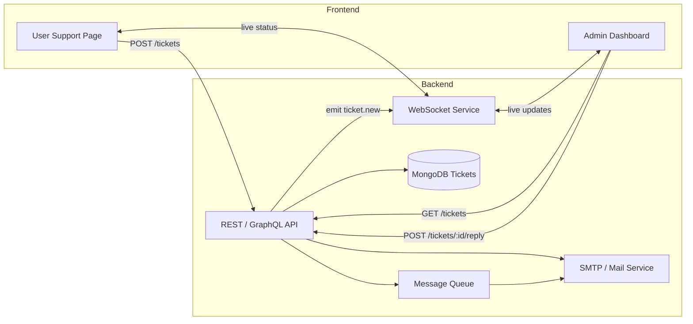

Here’s a high-level blueprint for a two-sided support system—one “Customer” side and one “Admin” side—showing the architecture, data-flow and key components you’ll need to build in React (frontend) + Node/Mongo (backend), but you can swap in whatever stacks you prefer.

---

## 1. System Architecture



* **Frontend**

  * **User Support Page**: “Submit Request” form (you already have), plus a “Track Ticket” view where user enters Ticket ID to see status & replies.
  * **Admin Dashboard**: central ticket list, filters (status, priority, category), detail panel (conversation thread + reply composer), agent-assignment controls.

* **Backend**

  * **API Layer** (Node/Express or GraphQL) to handle create/read/update of tickets, replies, status changes.
  * **WebSocket Service** (Socket.io or server-sent events) for real-time push of new tickets and replies.
  * **Database**: a `tickets` collection, each doc:

    ```js
    {
      _id,
      customer: { name, email, phone },
      category, priority, subject, createdAt, status, 
      thread: [ { from: "user"|"admin", message, timestamp } ],
      assignedTo?: agentId
    }
    ```
  * **Mail/Notifications**: SMTP or third-party (SendGrid) to notify user when admin replies.
  * **Message Queue** (optional) to buffer email jobs.

---

## 2. Customer-Facing Flow

1. **Submit Ticket**

   * Fill out form → `POST /tickets` → creates ticket, returns `ticketId`.
   * Show “Success” modal (you have this) with `ticketId`.

2. **Track & Reply**

   * “Track Ticket” page where user enters ID → `GET /tickets/:id` → displays ticket metadata + thread.
   * Optionally allow user to append additional messages: `POST /tickets/:id/reply`.

3. **Real-Time Updates**

   * Use WebSocket or polling so if admin responds, user sees reply immediately.

---

## 3. Admin-Facing Flow

1. **Dashboard List**

   * On load: `GET /tickets?status=open` → paginated table: columns \[ID, customer, subject, priority, status, createdAt].
   * Filters: status, priority, category, date-range.

2. **Detail & Reply Panel**

   * Click a row → slide-out panel or modal → fetch `GET /tickets/:id` → show:

     * Customer info
     * Thread (user & previous replies)
     * Controls: change status (open, pending, closed), reassign agent, priority/category edit.
     * Reply textarea → `POST /tickets/:id/reply`.

3. **Live Notifications**

   * Socket.io listener for `ticket.new` so agents see new incoming tickets in real time.
   * Desktop/browser notification badge.

4. **Agent Assignment & SLA**

   * Auto-assign to agent pools, or manual assign.
   * Show SLA countdown (e.g. “respond within 24 hrs”) with visual cue.

---

## 4. Component & Folder Structure (React)

```
src/
├─ api/                   ← axios or graphql clients
├─ components/
│  ├─ Customer/
│  │  ├─ SubmitForm.js
│  │  ├─ TicketTracker.js
│  ├─ Admin/
│  │  ├─ TicketTable.js
│  │  ├─ TicketDetailPanel.js
│  │  ├─ FiltersBar.js
│  ├─ UI/                 ← Buttons, Modals, Inputs, Icons
├─ contexts/              ← Auth, WebSocketContext
├─ hooks/                 ← useTickets, useWebSocket
├─ pages/
│  ├─ /support            ← customer
│  │  ├─ index.js
│  ├─ /admin              ← admin
│  │  ├─ index.js
└─ utils/                 ← date formatting, notification helpers
```

* **State Management**: React Context or Redux for global (tickets list, auth, socket).
* **Styling**: Tailwind CSS (as you’re using), keep design tokens in a single file for consistency.

---

## 5. API Endpoints (REST Example)

| Method | Path                 | Body / Query                        | Function                                  |
| ------ | -------------------- | ----------------------------------- | ----------------------------------------- |
| POST   | /tickets             | `{ customer, subject, message… }`   | Create ticket                             |
| GET    | /tickets             | `?status=open&priority=high&page=…` | List & filter tickets                     |
| GET    | /tickets/\:id        | —                                   | Get single ticket with full thread        |
| POST   | /tickets/\:id/reply  | `{ from: "admin", message }`        | Append reply & trigger notification/email |
| PATCH  | /tickets/\:id/status | `{ status: "closed" }`              | Change ticket status                      |
| PATCH  | /tickets/\:id/assign | `{ agentId: "…" }`                  | Assign to agent                           |

---

## 6. Data-Flow & Real-Time

1. **User submits** → API writes to DB → emits `ticket.new` over WebSocket + sends confirmation email.
2. **Admin dashboard** hears `ticket.new` → highlights new row.
3. **Admin replies** → API updates DB thread → enqueues email to user + emits `ticket.reply` to both admin & user socket rooms.
4. **User socket** receives `ticket.reply` → appends to thread view live.

---

## 7. Scaling & Extras

* **Pagination & Caching**: use cursor-based pagination for large ticket volume.
* **Search & Full-Text**: index subject/message in Mongo or add ElasticSearch for advanced queries.
* **RBAC**: protect admin routes with JWT + roles.
* **Attachments**: support file uploads by streaming to S3 and storing link in thread.
* **Analytics**: track metrics (avg response time, tickets per category) and expose in admin “Stats” panel.

---

With this foundation you can evolve a simple React form into a full-featured support center. Feel free to ask for deeper dives on any section (e.g. sample Express code, WebSocket setup, detailed React hook patterns, or DB migration scripts)!
