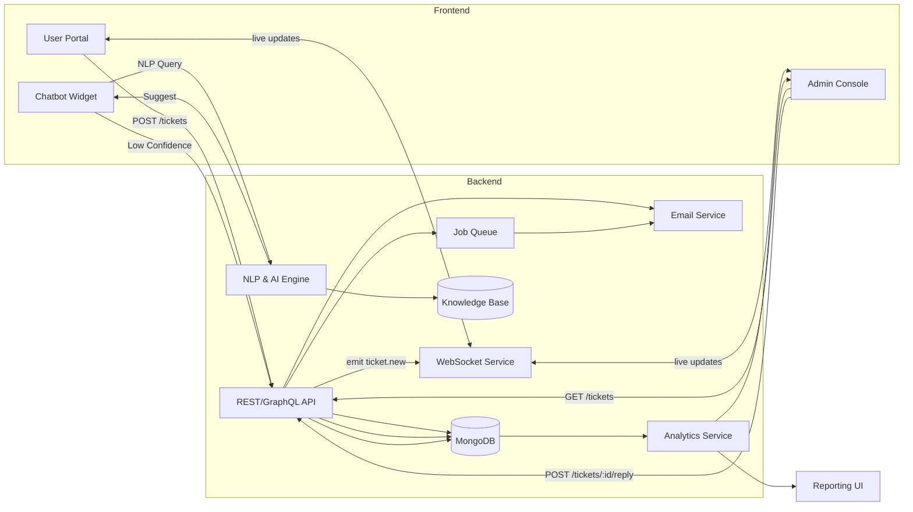
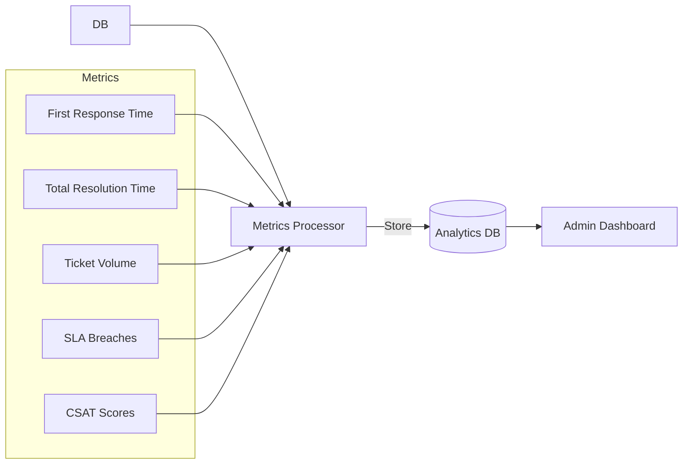
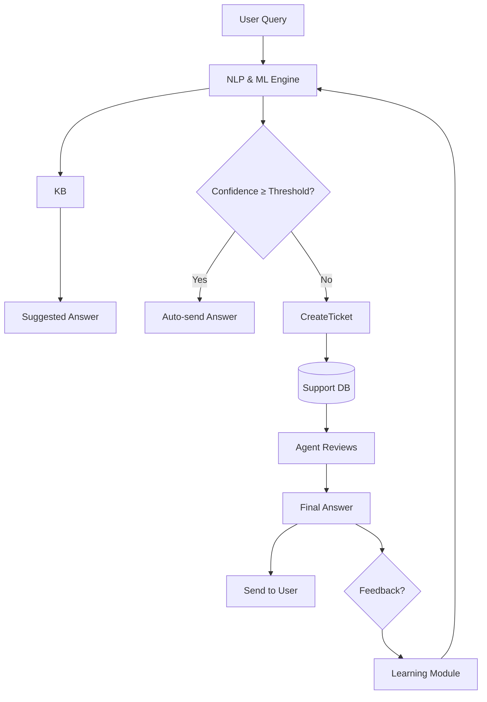

# Advanced Two‑Way Support System

An end‑to‑end, two‑sided support platform that handles everything from user intake to AI‑driven assistance, agent workflows, analytics, and feedback loops.

---

## 1. High‑Level Architecture



---

## 2. Permission‑Based Routing Flow

```mermaid
flowchart TD
  T[New Ticket]
  T --> C{Category Tagging}
  C -->|Billing| Q1[Billing Queue]
  C -->|Tech|  Q2[Tech Support]
  C -->|Account|Q3[Account Queue]

  subgraph Assignment
    Q1 & Q2 & Q3 --> A{Check Available Agents}
    A -->|Free| Assign[Assign Round‑Robin]
    A -->|None| Esc[Escalate to Manager]
  end

  Assign --> V{Role Check}
  Esc --> V

  V -->|L1 Agent| Handle[Handle & Reply]
  V -->|L2 Engineer| EscEng[Forward to Engineering]
  V -->|Manager| Review[Manager Review]

  Handle & EscEng & Review --> P[In Progress]
```

**Key steps:**

1. Automatic category detection via keywords/NLP.
2. Round‑robin assignment among free agents.
3. Fallback escalation when no agents are available.
4. Role‑driven branch: L1 → direct handling, L2 → engineering, Manager → oversight.

---

## 3. Real‑Time & Two‑Way Communication

1. **WebSocket Events**:

   * `ticket.new` → Admin & User notified instantly.
   * `ticket.update` → Push status changes & replies.
2. **Chatbot Widget**:

   * Shows dynamic suggestions from AI engine as user types.
   * If confidence > threshold, auto‑respond.
   * Else, create ticket and embed CSAT prompt.
3. **User Portal**:

   * Live thread view with instant scroll to new replies.
   * Ability to send follow‑up messages.

---

## 4. Analytics & Reporting Flow



**Dashboards show:**

* Average & distribution of first‑response and resolution times.
* Daily/weekly ticket volumes by category.
* SLA breach counts and trending.
* CSAT rating averages and recent feedback.

---

## 5. Self‑Learning Chatbot Flow



**Flow details:**

1. **Intake**: Chatbot uses AI to match intent and fetch KB articles.
2. **Auto‑Response**: High‑confidence replies go out immediately.
3. **Ticket Creation**: Low‑confidence cases are routed to agents.
4. **Agent Review**: Agents refine responses and send back.
5. **Feedback Loop**: User/agent feedback retrains models for better future suggestions.

---

## 6. SLA & Escalation Automation

* **SLA Timer** starts on ticket creation.
* **Reminder Ping**: Slack/email notification 30 minutes before SLA breach.
* **Auto‑Escalation**: Unaddressed tickets move to higher level or manager.
* **Auto‑Close**: Resolved tickets inactive for 7 days get closed with final nudge.

---

## 7. Knowledge Base Integration

* **Contextual Suggestions**: Agents see relevant articles in reply composer.
* **One‑Click Insert**: Add KB links directly to replies.
* **Article Feedback**: Agents can flag outdated or missing articles.
* **Analytics Sync**: Track which KB articles reduce ticket creation.

---

## 8. Security & Permissions

* **JWT Authentication** for API access.
* **Role‑Based Access Control**:

  * **Agents**: Read/Reply on assigned tickets only.
  * **Managers**: Full ticket visibility and reassignment rights.
  * **Engineers**: View escalated tickets, comment only.
  * **Admins**: Configuration and data export capabilities.

---

## Next Steps

1. Finalize API specs and MongoDB schema.
2. Scaffold frontend widgets and backend routes.
3. Integrate WebSocket server (Socket.io).
4. Plug in AI/NLP engine & KB service.
5. Build analytics pipelines and dashboards.
6. Test end‑to‑end with pilot user group.
